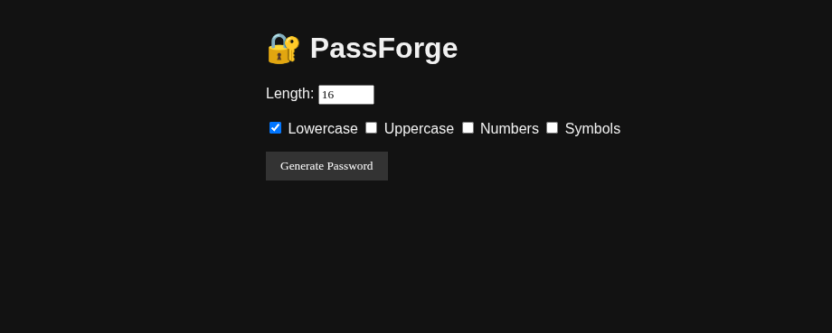
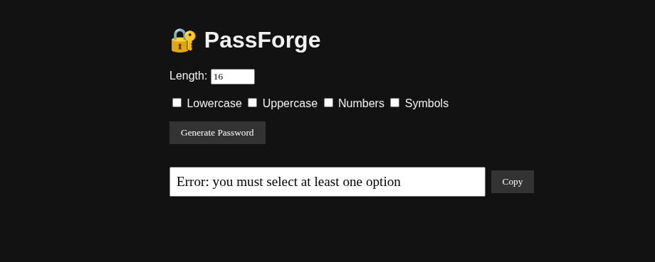
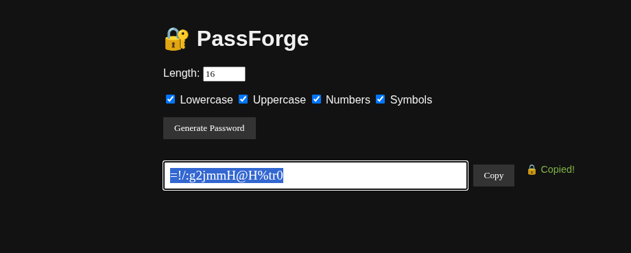

# 🔐 PassForge

Generador de contraseñas seguras, personalizadas y totalmente local.  
Diseñado para ser ligero, usable y sin dependencias externas. Desde navegador o terminal.

## ✨ Características

- Generación 100 % local con `secrets`
- Interfaz web con modo oscuro, responsive y sin distracciones
- Configurable:
  - Longitud personalizada
  - Lowercase / Uppercase / Numbers / Symbols (checkboxes)
- Botón "Copy" con confirmación discreta (sin alertas)
- Preparado para ampliación: CLI, diceware, stats...

## 🛠️ Stack

- Python + Flask
- HTML + CSS (modo oscuro)
- JS vanilla (sin frameworks)
- `secrets` para generación segura
- `pyperclip` (en la versión CLI futura)

## 🚀 Instalación y uso

```bash
git clone https://github.com/oscaar90/PassForge.git
cd PassForge
python3 -m venv venv
source venv/bin/activate
pip install -r requirements.txt
python run.py
```

Abre en navegador:
http://localhost:5000

🖼️ Captura

## 🖼️ Capturas

### Interfaz principal



### Error si no se selecciona ninguna opción



### Copiado con confirmación discreta



📁 Estructura

<pre lang="markdown"> <code> ## 📁 Project structure PassForge/ ├── app/ │ ├── __init__.py │ ├── routes.py │ ├── generator.py ├── static/ │ ├── css/ │ │ └── style.css │ └── js/ │ └── main.js ├── templates/ │ └── index.html ├── run.py ├── requirements.txt └── README.md </code> </pre>

🧪 Estado del proyecto
✅ Funcional y estable
📦 Listo para ser usado o extendido
🚧 Versión CLI en preparación

📝 Licencia
MIT – Usa, modifica y comparte sin restricciones.